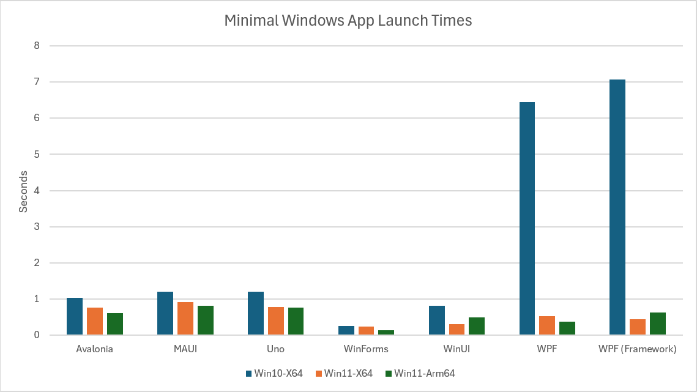

# WinAppLaunchCompare

An attempt to compare the start time of Windows apps built with different frameworks.

All of them _should_ be "good enough" (or fast enough) for whatever you're doing. This was just an exploration of possible insights or anomalies that may exist.

This is a best effort attempt to remove as much as possible to make things as similar between the different apps as possible. Obviously, different frameworks do different things in different ways. By removing all but the bare minimum from the apps (so all they do is show some text) I believe this is the most _reasonable_ way to compare them all.

The goal was to look at how long it took until it was possible to display something on screen.

This was done by sending a custom windows message when the TextBlock (or Label) displayed on the page/window reported that it had been loaded. A separate app launched the app being tested and recorded the time until the message was received.

Obviously:

- A "real" app will involve much more functionality and various dependencies, not all of these dependencies, controls, and functionality are available from all frameworks and so would prevent the ability to do a "fair" comparative test.
- Results will vary based on the machine that they are run on. Run this yourself and see how it behaves on your machine(s).
- The cross-platform frameworks may produce very different results when run on different operating-systems.
- Different frameworks have different things built-in that they do when they start up. I tried to turn off all of these. (If I've missed something and want to submit a PR, I'll rerun the test with the change.)
- There may be additional performance gains to be had by using AOT or any custom trimming. (If you want to try with this, PRs are welcome.)

Here are the results of when I ran it.

I haven't included the figures in the graph as it's the relative differences that matter. They're below if you really want to see how things performed on the machine I tested on.  
WPF is _really_ slow, WinForms is fast, everything else is about the same.

This data is from the Release builds of each app. I launched each app ten times and excluded the fastest and slowest overall times for each framework.

Average times (in milliseconds)

| Framework       | Version       | Win10 | Win11 x64 | Win11 Arm64 |
|-----------------|---------------|-------|-----------|-------------|
| Avalonia        | 11.3.0        | 1027  | 757       | 605         |
| .NET MAUI       | 9.0.90        | 1199  | 919       | 813         |
| Uno Platform    | 6.1.23        | 1196  | 776       | 755         |
| Windows Forms   | 9.0           | 248   | 231       | 137         |
| WinUI           | 1.7.250606001 | 813   | 308       | 498         |
| WPF             | 9.0           | 6449  | 524       | 372         |
| WPF (framework) | 4.8.1         | 7064  | 434       | 629         |

Miscellaneous observations:

- As expected, WinForms was super fast.
- WPF (both .NET and Framework versions) was surprisingly (disappointingly) slow on Windows 10. I assume that efforts to optimize launch times didn't include Win10.
- The difference between MAUI and WinUI is surprising given MAUI uses WinUI to create the Windows version of apps. I expected these to be closer.
- Of the cross-platform options (and WinUI) the difference is basically irrelevant. Having clicked the button to launch the apps many, many times, I didn't perceive any real difference, never feeling that one was slow or faster than the others.
- There isn't a consistent performance difference between ARM and X64. ARM based devices have other potential benefits though.

My takeaways:

- For choosing a cross-platform framework there's hardly anything in it in terms of the time it takes to launch the apps.
- I wouldn't base a decision to use a particular framework based on these (or similar) tests/results.
- I also looked at the time until the `App` class was loaded. This varied but didn't seem to be related to the overall time taken.
- Performing tests like these can easily become an infinite rabbit hole. There are always potential tweaks and optimizations that could be done. If you have such an interest, please go ahead.

None of my above comments should be understood as to imply that start-up time isn't important.  
The time an app takes to launch is important, but there's no magic figure that can be applied to all circumstances. **Yes, smaller is better but as long as the people using the app don't complain about the wait on the devices they are using then aiming to improve this time is unlikely to be the most effective use of a developer's time**. There are probably features that could be added or bugs that could be fixed that would provide more value.

Regardless of the above, measuring start time is important. Once it's "good enough", you want to make sure that nothing is done to change this. The only way to ensure that this doesn't suffer is to monitor it during development. You don't want to think that development is finished and then try and address changes that have made the launch time unacceptable. It's better to catch them as soon as they occur.

It's also good (and appropriate) that the people building frameworks care about launch times. Not because there's a magic number they should try and reach or because being faster makes them a better option than an alternative but because it will help all the people who use it to build apps.  
How much they should prioritize it will depend on how valuable any improvement will be to the people who are using it compared to other things they could do.

All that said, most developers will benefit by thinking a bit more about performance. Fortunately, there is lot of official documentation to help:

- WPF :- https://learn.microsoft.com/en-us/dotnet/desktop/wpf/advanced/optimizing-wpf-application-performance
- WinUI :- https://learn.microsoft.com/en-us/windows/apps/performance/winui-perf
- Uno :- https://platform.uno/docs/articles/Uno-UI-Performance.html
- MAUI :- https://learn.microsoft.com/en-us/dotnet/maui/deployment/performance?view=net-maui-9.0
- Avalonia :- https://docs.avaloniaui.net/docs/guides/development-guides/improving-performance
